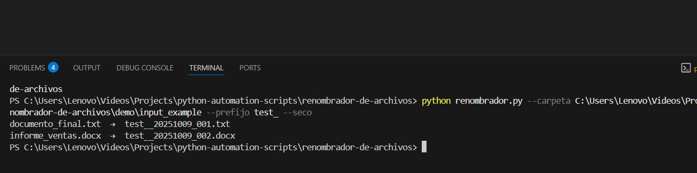
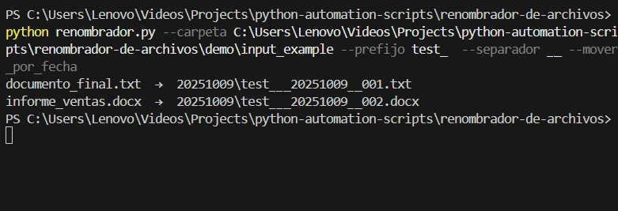

# Renombrador de archivos

Automatiza el proceso de renombrar múltiples archivos en masa según un patrón (prefijo, sufijo o reemplazo). Ideal para organizar carpetas con cientos de fotos, documentos o descargas.

### Ejemplo de uso
```bash
python renombrador.py --carpeta --prefijo --separador --mover_por_fecha --seco
```

### Requisitos
Python 3.8+

No requiere librerías externas

### Entrega
Incluye script + README + demo + soporte 3 días.

### Ejemplo de ejecución

#### 🔹 Modo seco (`--seco`)


#### 🔹 Modo real
